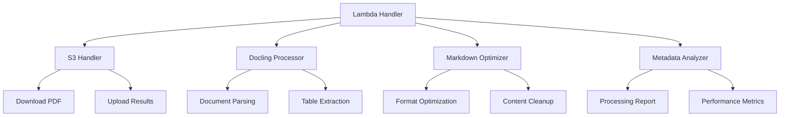

# doc2md-s3

**基于 Docling 的 PDF 转 Markdown 的 AWS Lambda 函数，使用 S3 作为输入输出存储**

## 🎯 项目概述

`doc2md-s3` 是一个强大的 AWS Lambda 函数，专门用于将 PDF 文档转换为高质量的 Markdown 格式。该项目充分利用了 [Docling](https://github.com/docling-project/docling) 项目的先进文档解析能力，支持复杂的表格结构、文本格式和版面识别。

### 核心特性

- 🔄 **高质量转换**: 使用 Docling 进行先进的 PDF 解析和 Markdown 转换
- 📊 **表格支持**: 完整保留表格结构和格式
- 🗂️ **S3 集成**: 使用 S3 作为输入输出存储，避免 Lambda 大小限制
- 📈 **详细元数据**: 提供完整的处理报告和文档分析
- 🏗️ **结构化日志**: 符合 JSON 格式的结构化日志输出
- 🔒 **错误处理**: 完善的错误处理和异常捕获
- ⚡ **高性能**: 优化的处理流程和内存使用

## 📁 项目结构

```
doc2md-s3/
├── lambda_function.py      # 主 Lambda 处理器
├── s3_handler.py          # S3 文件操作模块
├── docling_processor.py   # Docling 文档处理模块
├── markdown_optimizer.py  # Markdown 输出优化模块
├── metadata_analyzer.py   # 元数据分析模块
├── requirements.txt       # Python 依赖配置
├── deploy.sh             # 部署脚本
├── test_local.py         # 本地测试脚本
├── test_output/          # 测试输出目录
│   ├── test_output.md    # 测试生成的 Markdown
│   ├── test_metadata.json # 测试元数据
│   └── test_report.json  # 测试处理报告
└── README.md             # 项目文档
```

## 🚀 快速开始

### 1. 环境准备

```bash
# 创建虚拟环境
python3 -m venv venv
source venv/bin/activate

# 安装依赖
pip install -r requirements.txt
```

### 2. 本地测试

```bash
# 运行本地测试
python test_local.py
```

测试将会：
- 处理测试 PDF 文件
- 生成 Markdown 输出
- 创建详细的元数据报告
- 保存结果到 `test_output/` 目录

### 3. 部署到 AWS Lambda

```bash
# 创建部署包
./deploy.sh
```

这将创建 `lambda-deployment.zip` 文件，可以通过 AWS 控制台或 CLI 部署。

## 📋 API 使用

### 输入事件格式

```json
{
  "source_bucket": "my-documents",
  "source_key": "input/document.pdf",
  "output_bucket": "my-processed-docs",
  "output_key": "processed/document.md",
  "metadata_key": "processed/document_metadata.json",
  "options": {
    "ocr_enabled": true,
    "preserve_tables": true,
    "preserve_formatting": true,
    "markdown_optimization": true
  }
}
```

### 输出响应格式

**成功响应 (200)**:
```json
{
  "status": "success",
  "request_id": "abc123",
  "outputs": {
    "markdown_s3_uri": "s3://bucket/processed/document.md",
    "metadata_s3_uri": "s3://bucket/processed/document_metadata.json"
  },
  "processing_summary": {
    "total_time": "25.3s",
    "page_count": 12,
    "content_length": 15420,
    "table_count": 5
  },
  "performance_metrics": {
    "s3_download": "1.2s",
    "docling_processing": "20.5s",
    "markdown_optimization": "0.1s",
    "s3_upload": "0.8s"
  }
}
```

**错误响应 (4xx/5xx)**:
```json
{
  "status": "error",
  "request_id": "abc123",
  "error": "详细错误信息",
  "processing_time": "5.2s"
}
```

## 🔧 配置选项

### 处理选项

| 选项 | 类型 | 默认值 | 描述 |
|------|------|--------|------|
| `ocr_enabled` | boolean | `true` | 启用 OCR 文字识别 |
| `preserve_tables` | boolean | `true` | 保留表格结构 |
| `preserve_formatting` | boolean | `true` | 保留文档格式 |
| `markdown_optimization` | boolean | `true` | 启用 Markdown 优化 |

### Lambda 配置建议

| 配置项 | 推荐值 | 说明 |
|--------|--------|------|
| 内存 | 10GB | 处理大型文档需要更多内存 |
| 超时 | 15分钟 | 复杂文档处理时间较长 |
| 运行时 | Python 3.9 | 兼容 Docling 依赖 |

## 📊 性能指标

### 测试结果

基于测试文件 `美术外包合同审核共同点AI总结-V3.pdf` 的处理结果：

| 指标 | 值 |
|------|-----|
| 页数 | 2 页 |
| 处理时间 | ~34 秒 |
| 输出长度 | 1,466 字符 |
| 表格处理 | 1 个表格 |
| 优化效果 | 25.81% 大小减少 |
| 优化项目 | 6 项优化 |

### 性能特点

- **首次调用**: 需要下载 Docling 模型，时间较长
- **后续调用**: 模型已缓存，处理速度较快
- **内存使用**: 建议配置 10GB 内存
- **处理速度**: 取决于 PDF 复杂度，通常 20-60 秒

## 🏗️ 架构设计

### 模块化设计



### 处理流程

1. **输入验证**: 验证 S3 路径和参数
2. **文件下载**: 从 S3 下载 PDF 文件
3. **文档处理**: 使用 Docling 解析 PDF
4. **内容优化**: 优化 Markdown 输出
5. **元数据生成**: 生成处理报告和统计信息
6. **结果上传**: 将 Markdown 和元数据上传到 S3
7. **清理资源**: 清理临时文件

## 📝 日志格式

所有日志采用结构化 JSON 格式：

```json
{
  "timestamp": "2025-07-11T06:35:53Z",
  "level": "INFO",
  "service": "doc2md-s3",
  "action": "docling_process",
  "requestId": "abc123",
  "result": "success",
  "processingTime": "34.08s",
  "pageCount": 2,
  "contentLength": 1976
}
```

### 日志级别

- `INFO`: 正常处理步骤
- `ERROR`: 错误和异常
- `WARNING`: 警告信息

## 🔒 权限配置

### IAM 角色权限

Lambda 执行角色需要以下权限：

```json
{
  "Version": "2012-10-17",
  "Statement": [
    {
      "Effect": "Allow",
      "Action": [
        "logs:CreateLogGroup",
        "logs:CreateLogStream",
        "logs:PutLogEvents"
      ],
      "Resource": "arn:aws:logs:*:*:*"
    },
    {
      "Effect": "Allow",
      "Action": [
        "s3:GetObject",
        "s3:PutObject",
        "s3:DeleteObject",
        "s3:ListBucket"
      ],
      "Resource": [
        "arn:aws:s3:::your-bucket/*",
        "arn:aws:s3:::your-bucket"
      ]
    }
  ]
}
```

## 🧪 测试

### 本地测试

```bash
# 运行完整测试套件
python test_local.py

# 测试特定模块
python -c "from docling_processor import DoclingProcessor; print('✅ Docling module OK')"
```

### 测试覆盖

- ✅ Docling 文档处理
- ✅ Markdown 优化
- ✅ 元数据生成
- ✅ 文件保存
- ✅ 错误处理

## 🐛 故障排除

### 常见问题

1. **SSL 证书错误**
   - 已在代码中处理：`ssl._create_default_https_context = ssl._create_unverified_context`

2. **内存不足**
   - 增加 Lambda 内存配置到 10GB

3. **处理超时**
   - 增加超时时间到 15 分钟
   - 检查 PDF 文件大小和复杂度

4. **依赖包过大**
   - 当前包大小约 200MB，在 Lambda 限制内
   - 如需优化，考虑使用 Lambda Layers

### 调试技巧

```bash
# 查看详细日志
python test_local.py 2>&1 | grep -E "(ERROR|INFO)"

# 检查文件权限
ls -la test_output/

# 验证 S3 路径
aws s3 ls s3://your-bucket/path/
```

## 📈 性能优化

### 优化建议

1. **内存配置**: 根据文档大小调整内存
2. **并发控制**: 控制并发执行数量
3. **缓存策略**: 利用 Lambda 容器重用
4. **文件清理**: 及时清理临时文件

### 监控指标

- 处理时间
- 内存使用
- 错误率
- 吞吐量

## 🤝 贡献指南

1. Fork 项目
2. 创建特性分支
3. 提交更改
4. 创建 Pull Request

## 📄 许可证

本项目基于 MIT 许可证。Docling 库遵循其原始许可证。

## 🔗 相关链接

- [Docling 项目](https://github.com/docling-project/docling)
- [AWS Lambda 文档](https://docs.aws.amazon.com/lambda/)
- [Markdown 规范](https://spec.commonmark.org/)

## 📞 支持

如有问题或建议，请创建 Issue 或联系维护者。

---

**doc2md-s3** - 让 PDF 转 Markdown 变得简单高效！ 